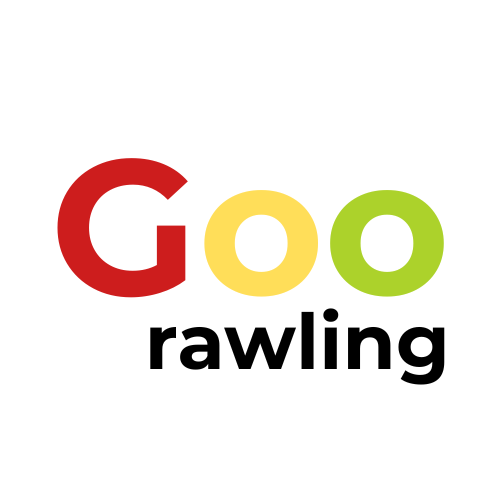

  
  

# goorawling

    
        Google
        <strong> Crawling ???</strong>
    

---

Welcome to the Goorawling project!

(Add more details about your project here...)

## About

(Describe your project.)

## Features

* Feature 1
* Feature 2

## Getting Started

(How to get your project set up.)
